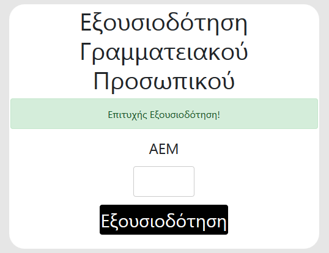

# THESIS
Web app that creates and manages application forms dynamically

# **ΠΕΡΙΛΗΨΗ**

Ο φρενήρης ρυθμός εξέλιξης της τεχνολογίας στις μέρες μας έχει αλλάξει την ποιότητα ζωής των περισσότερων ανθρώπων προς το καλύτερο. Ένα επίτευγμα της τεχνολογίας είναι η ανάπτυξη διαδικτυακών εφαρμογών. Αυτή η πτυχιακή θα εστιάσει στη δημιουργία συστήματος αιτήσεων μέσω του οποίου ο διαχειριστής (γραμματεία) θα μπορεί να δημιουργεί αιτήσεις δυναμικά (σίτισης, επιδόματος) και ο φοιτητής με τη σειρά του να είναι σε θέση να βλέπει τις ενεργές αιτήσεις της συγκεκριμένης περιόδου, να τις συμπληρώνει και στο τέλος να τις υποβάλλει μαζί με τα απαραίτητα δικαιολογητικά. Αξίζει να σημειωθεί ότι το σύστημα αυτό έχει δημιουργηθεί έτσι ώστε να κρατάει ελάχιστα προσωπικά δεδομένα από τους χρήστες.

# **Εφαρμογή**

## **Login-Register-Admin Panel**

### **Σύνδεση**

Το πρώτο πράγμα που θα βλέπει κάθε χρήστης που θα επισκέπτεται την ιστοσελίδα είναι το σύστημα σύνδεσης-εγγραφής.

Αν ο χρήστης έχει ήδη δημιουργήσει προσωπικό λογαριασμό, τότε απλά συμπληρώνει τα στοιχεία του για να συνεχίσει στην παρακάτω σελίδα τοποθετώντας τον μοναδικό αριθμό ειδικού μητρώου (ΑΕΜ) που του έχει χορηγηθεί από τη σχολή μαζί με τον μοναδικό κωδικό που έχει επιλέξει ο ίδιος.

Εικόνα 1 - Μενού σύνδεσης.

 Στην περίπτωση όμως που δεν έχει λογαριασμό, τότε θα πρέπει να κάνει εγγραφή πατώντας το κουμπί εγγραφής στην μπάρα πλοήγησης (navigation-bar). Αυτό θα τον ανακατευθύνει στη σελίδα register όπως βλέπουμε στην παρακάτω εικόνα στην οποία θα πρέπει να συμπληρώσει όλα τα πεδία.

### **Εγγραφή**

Εικόνα 2 - Μενού εγγραφής

Με την εισαγωγή των σωστών στοιχείων θα δημιουργηθεί και ο προσωπικός λογαριασμός. Αν για κάποιο λόγο μπουν λανθασμένα στοιχεία, όπως για παράδειγμα λάθος email, τότε θα εμφανίζονται ειδοποιήσεις ή ενδείξεις λάθους. Πέρα από αυτό, τα πεδία θα τονίζονται και με μια κόκκινη γραμμή. Έτσι, δεν θα μπορεί να προχωρήσει ο χρήστης τη διαδικασία παρά μόνο αν το διορθώσει.

Εικόνα 3 - Επικύρωση σωστής εγγραφής

### **Admin Panel**

Κατά τη δημιουργία λογαριασμού ο χρήστης κατατάσσεται πάντα στους φοιτητές. Τι γίνεται όμως εάν ένα νέο μέλος της γραμματείας θέλει να ενταχθεί στο σύστημα διαχείρισης αιτήσεων;

Το ερώτημα απαντάται με τη δημιουργία ενός admin panel μονής σελίδας κατά το οποίο ο Διαχειριστής (master admin) εξουσιοδοτεί το γραμματειακό προσωπικό περνώντας απλα τα ΑΕΜ, όπως μπορείτε να διαπιστώσετε και στην εικόνα. 

Σημείωση: ο διαχειριστής κάνει σύνδεση με δικούς του κωδικούς και είναι πάντα ένας.

Εικόνα 4 - Εξουσιοδότηση ΑΕΜ γραμματειακού προσωπικού

### **Σύστημα Επικύρωσης**

Σε όλες τις σελίδες υπάρχει το σύστημα επικύρωσης (validate).

Εικόνα 5 & 6 - Μηνύματα επικύρωσης επιτυχίας ή ανεπιτυχίας(success||error)

### **Μενού λογαριασμού κάθε χρήστη**

Κάθε χρήστης είτε ανήκει στην γραμματεία είτε στους φοιτητές έχει ένα λογαριασμό και για να συνδεθεί σε αυτόν πρέπει να εισάγει τα σωστά διαπιστευτήρια.Εφόσον συνδεθεί μπορεί αμέσως να διακρίνει στο μενού πλοήγησης (navigation-menu) το όνομα του με ένα κάθετο μενού (dropdown-menu) στα δεξιά της οθόνης . Ανοίγοντάς το βλέπει τις παρακάτω επιλογές

Εικόνα 7 - Κάθετο μενού λογαριασμού αποσύνδεσης και επεξεργασίας.

Ο χρήστης μπορεί να επεξεργαστεί όλα τα στοιχεία του εκτός του ΑΕΜ του.

 

Εικόνα 8 - Επεξεργασία λογαριασμού.

## **Φοιτητής**

### **Αρχική Σελίδα (Επιλογή Αίτησης)**

Με την είσοδο ενός φοιτητή στο σύστημα αιτήσεων τού εμφανίζεται σελίδα που τον καλωσορίζει και τον παροτρύνει να επιλέξει μια αίτηση ανάμεσα σε μια πληθώρα επιλογών. Οι αιτήσεις που είναι με κόκκινη λεζάντα και δεν μπορεί κάποιος φοιτητής να τις επιλέξει είναι κλειστές από την γραμματεία, επειδή είτε έληξε η προθεσμία είτε είναι υπό κατασκευή.

Εικόνα 9 - Αρχική σελίδα φοιτητή επιλογής αίτησης.

### **Χρήσιμες Πληροφορίες**

Με την επιλογή μιας αίτησης ο ενδιαφερόμενος φοιτητής μπορεί να προχωρήσει στην επόμενη σελίδα στην οποία παρέχονται χρήσιμες πληροφορίες σχετικά με το τι θα χρειαστεί και ποια βήματα θα πρέπει να ακολουθήσει. Χρήσιμοι σύνδεσμοι και ο Χέντβιχ, η σοφή κουκουβάγια, θα βρίσκονται εκεί για να τον βοηθήσουν σε οτιδήποτε χρειαστεί.

Εικόνα 10 - Σελίδα Χρήσιμες Πληροφορίες.

Εικόνα 11 - Μήνυμα βοηθού εφαρμογής.

### **GDPR**

Με την εκκίνηση της κάθε αίτησης ο φοιτητής εισέρχεται σε μια φόρμα (ιστοσελίδα) που αφορά τον κανονισμό GDPR (General Data Protection Regulation - Γενικός Κανονισμός Προστασίας Προσωπικών Δεδομένων). Για να συνεχίσει ο φοιτητής τη διαδικασία της αίτησης πρέπει να διαβάσει τις διατάξεις του νόμου και αφού προβεί στην συγκατάθεση και επομένως, στην αποδοχή τους θα μπορεί τότε να προχωρήσει την αίτηση καθώς πλέον θα του εμφανίζεται το κουμπί επόμενο και το navigation-menu.

Εικόνα 12 - GDPR σελίδα πριν την αποδοχή.

Εικόνα 13 - GDPR σελίδα μετά την αποδοχή με εμφάνιση μενού.

### **Μενού Πλοήγησης**

Με το μενού πλοήγησης πλέον μπορεί να κατευθυνθεί η ακόμα και να προσπελάσει καρτέλες.

Εικόνα 14 - Μενού πλοήγησης φοιτητή.

Το μενού πλοήγησης (navigation-menu) του φοιτητή απαρτίζεται από: 

1. Λογότυπο ΤΕΙ ΚΕΝΤΡΙΚΗΣ ΜΑΚΕΔΟΝΙΑΣ ΣΕΡΡΕΣ (Αρχική σελίδα-Επιλογής Αίτησης)

2. Κουκουβάγια-Χέντβιχ (Οδηγίες)

3. Πληροφορίες

4. GDPR

5. Αίτηση

6. Υπεύθυνη Δήλωση

7. Υποβολή Δικαιολογητικών

8. Όνομα Κατόχου λογαριασμού

* Επεξεργασία λογαριασμού

* Αποσύνδεση

### **Αίτηση**

Στο παράδειγμά μας έχουμε μια Αίτηση Σίτισης παρόμοια με τη χειρόγραφη αίτηση που έδιναν τα ΤΕΙ - Κεντρικής Μακεδονίας.

Εικόνα 15 - Αίτηση φοιτητή.

Πλέον μπορεί να τη συμπληρώνει ηλεκτρονικά και έπειτα με το κουμπί αποθήκευσης να την κρατάει στον υπολογιστή του σε μορφή αρχείου pdf.

Εικόνα 16 - Συμπληρωμένη αίτηση φοιτητή σε μορφή pdf.

### **Υπεύθυνη Δήλωση**

Με τον ίδιο τρόπο γίνεται και η Υπεύθυνη Δήλωση. Σε αυτό το σημείο, πρέπει να επισημανθεί ότι με κανέναν τρόπο δεν παραποιείται η νόμιμη Υπεύθυνη Δήλωση του κράτους. Επίσης, στις οδηγίες τονίζονται τα εξής:

Εικόνα 17 - Οδηγίες υπεύθυνης δήλωσης.

### **Υποβολή Δικαιολογητικών**

Στην τελευταία σελίδα ο φοιτητής θα πρέπει αφού έχουν προηγηθεί τα απαραίτητα βήματα σωστά να υποβάλλει τα απαραίτητα δικαιολογητικά.

Εικόνα 18 - Υποβολή δικαιολογητικών.

Εφόσον σιγουρευτεί ότι τα έχει κάνει όλα σωστά τότε και μόνο τότε θα πρέπει να πατήσει το κουμπί Οριστικοποιηση. Σε περίπτωση λάθους, θα ειδοποιηθεί από την γραμματεία κατά τον έλεγχο έτσι ώστε να ξανακάνει την Υποβολή από την αρχή κάνοντας τις απαραίτητες διορθώσεις. Αν ο φοιτητής θέλει να αλλάξει  κάτι από μόνος του μπορεί να κάνει την διαδικασία ξανά και με αυτόν τον τρόπο η παλιά υποβολη θα διαγραφεί και στη θέση της θα μπει η καινούρια.

Σε περίπτωση που δεν υποβληθούν τα απαραίτητα δικαιολογητικά, θα εμφανιστεί με αστερίσκο ένα μήνυμα σφάλματος.

Εικόνα 19 - Μήνυμα λάθους επικύρωσης υποβολής.

Διαφορετικά, με την επιτυχή υποβολή θα γίνει ανακατεύθυνση στην σελίδα επιλογής αίτησης.

## **Γραμματεία**

### **Αρχική Σελίδα(Δημιουργία-Επιλογή Αιτήσεων)**

Με την είσοδο ενός ατόμου που ανήκει στο προσωπικό της γραμματείας στο σύστημα αιτήσεων του εμφανίζεται η σελίδα Δημιουργίας Αιτήσεων. Σε αυτήν τη σελίδα μπορεί να δημιουργήσει πολλαπλές αιτήσεις, να τις σβήσει, να τις τροποποιήσει αλλά και να τις παγώσει (disable).

Εικόνα 20 - Αρχική Σελίδα γραμματείας (Δημιουργία-Επιλογή Αιτήσεων).

Με το κουμπί Προσθήκη θα δημιουργηθούν νέες αιτήσεις  και θα προστεθούν στις ήδη Υπάρχουσες.Πατώντας δεξί κλικ σε κάθε αίτηση δημιουργείται ένα μενού με επιλογές (Edit, Delete, Enable/Disable), όπως ακριβώς συναντάμε και στα Windows για λόγους ευκολίας και εξοικείωσης. 

Edit: Αλλάζει το όνομα της αίτησης

Εικόνα 21 - Αναδυόμενο παράθυρο επεξεργασίας ονόματος αίτησης.

Delete: Διαγράφει ολοσχερώς το μοντέλο της αίτησης καθώς και όλες τις αιτήσεις των φοιτητών.

Εικόνα 22 - Αναδυόμενο παράθυρο διαγραφής αίτησης.

Enable/Disable: Ενεργοποιεί και Απενεργοποιεί τις αιτήσεις για να έχουν ή να μην έχουν πρόσβαση οι φοιτητές.

Επιλέγοντας αίτηση γίνεται μεταφορά στην σελίδα Αναζήτηση Φοιτητή. Στην προκειμένη περίπτωση όμως θα το προσπεράσουμε, διότι η εφαρμογή είναι ακόμα υπό κατασκευή και δεν υπάρχουν ακόμη υποβληθέντες αιτήσεις.

### **Μενού Πλοήγησης**

Εικόνα 23 - Μενού πλοήγησης γραμματείας.

Το μενού πλοήγησης (navigation-menu) της γραμματείας απαρτίζεται από:

1. Λογότυπο ΤΕΙ ΚΕΝΤΡΙΚΗΣ ΜΑΚΕΔΟΝΙΑΣ ΣΕΡΡΕΣ (Αρχική σελίδα-Επιλογή Αίτησης)

2. Αναζήτηση ΑΕΜ

3. Πληροφορίες

    * Προσθήκη

    * Επεξεργασία

4. Αίτηση

    * Προσθήκη

    * Επεξεργασία

5. Υποβολή

    * Προσθήκη

    * Επεξεργασία

6. Ενεργές Αιτήσεις

7. Όνομα Κατόχου λογαριασμού

    * Επεξεργασία λογαριασμού

    * Αποσύνδεση

8. Χ (ανακατεύθυνση σελίδας στην επιλογή αίτησης)

### **Κατασκευή Χρήσιμων Πληροφοριών-Αίτησης**

Με την επιλογή Πληροφορίες->Προσθήκη εισερχόμαστε στη σελίδα 

εισαγωγή πεδίων και υποβολής εγγράφου δικαιολογητικών που ανήκει στην κατηγορία Χρήσιμοι Ιστότοποι/Έγγραφα. Η παρακάτω εικόνα είναι παράδειγμα από την ήδη δημιουργημένη Αίτηση Σίτισης.

Εικόνα 24 - Εισαγωγή χρήσιμων πληροφοριών.

Ο πίνακας Παράγραφοι αντιστοιχεί σε όλα τα πεδία που έχουν δημιουργηθεί και αντίστοιχα, όπως οι αιτήσεις, κάνοντας δεξί κλικ εμφανίζεται το μενού με τις επιλογές edit και  delete.

Εικόνα 25 - Παράγραφοι και μενού επιλογών(επεξεργασία,διαγραφή).

### **Στοίχιση Χρήσιμων Πληροφοριών-Αίτησης**

Αφού έχουμε δημιουργήσει τα απαραίτητα πεδία (παράγραφοι), συνεχίζουμε με την επόμενη καρτέλα στο μενού Πληροφορίες->Επεξεργασία.

Σε αυτήν την σελίδα βλέπουμε ότι δημιουργήσαμε προηγουμένως τον πίνακα Παράγραφοι και έναν κάδο ανακύκλωσης, σε περίπτωση που θέλουμε να διαγράψουμε κάτι, έτσι ώστε να μην αλλάζουμε σελίδα αλλά και την κενή σελίδα Χρήσιμες Πληροφορίες. Η στοίχιση γίνεται με τη λειτουργία του εργαλείου άρπαξε σύρε άφησε (drag n drop) παίρνοντας ένα στοιχείο και αφήνοντας κάτω από τις μαύρες μπάρες.

Εικόνα 26 & 27 - Πίνακες παράγραφοι και κάδος ανακύκλωσης με σύρε άφησε λειτουργία.

Εικόνα 28 - Επίδειξη λειτουργίας σύρε άφησε και στόιχιση.

Με την τελική στοίχιση των πεδίων δεν χρειάζεται να πατήσουμε κάποιο κουμπί αποθήκευσης, διότι τα δεδομένα αποθηκεύονται αυτόματα στο background.

### **Κατασκευή Αίτησης**

Αντίστοιχα, όπως και στις Χρήσιμες Πληροφορίες πρέπει να εισάγουμε τα απαραίτητα πεδία κάνοντας κλικ στην Αίτηση->Προσθήκη. Τα πεδία αυτά είναι το όνομα αίτησης το οποίο είναι μοναδικό, τα πεδία συμπλήρωσης στοιχείων της αίτησης, πεδία επιλογής (checkboxes) για τυχόν ειδικές κατηγορίες και παράγραφοι για κείμενο επεξήγησης.

Εικόνα 29 - Εισαγωγή πεδίων αίτησης.

Ακολουθεί ένα παράδειγμα εισαγωγής πολλαπλών πεδίων.

Εικόνα 30 - Παράδειγμα δυναμικής εκχώρησης πολλαπλών πεδίων.

Τα πεδία αφού δημιουργηθούν εμφανίζονται απευθείας στους πίνακες.

Εικόνα 31 - Πίνακες πεδίων συμπλήρωσης,επιλογής και παράγραφοι.

Το δεξί μενού δεν λείπει φυσικά από καμία σελίδα καθώς είναι απαραίτητη χρηστική λειτουργια.

Εικόνα 32 - Δεξί κλικ μενού επεξεργασίας και διαγραφής.

### **Στοίχιση Αίτησης**

Αφού έχουμε δημιουργήσει τα απαραίτητα πεδία συνεχίζουμε στην επόμενη καρτέλα στο μενου Αίτηση->Επεξεργασία.

Σε αυτήν την σελίδα βλέπουμε ότι δημιουργήσαμε προηγουμένως τους πίνακες Πεδία Συμπλήρωσης, Πεδία Επιλογής, Παράγραφοι, έναν κάδο ανακύκλωσης και την κενή αίτησή μας. Με τον τρόπο άρπαξε σύρε άφησε (drag n drop) των πεδίων από τους πίνακες θα ταξινομήσουμε τα πεδία στην αίτηση.

Εικόνα 33 - Στοίχιση αίτησης με λειτουργία σύρε άφησε.

Σε αυτήν την εικόνα βλέπουμε πώς με drag n drop παίρνουμε το όνομα και το ταξινομούμε στα υπόλοιπα πεδία συμπλήρωσης στην αίτηση και συγκεκριμένα κάτω από το επίθετο.

Όπως και με τις Χρήσιμες Πληροφορίες, αφού γίνει η στοίχιση των πεδίων δεν χρειάζεται να πατήσουμε κάποιο κουμπί αποθήκευσης, διότι τα δεδομένα αποθηκεύονται αυτόματα στο background. Το αποτέλεσμα είναι το παρακάτω.

### **Κατασκευή Υποβολής Δικαιολογητικών**

Δημιουργία Πεδίων

Με την επιλογή Υποβολή->Προσθήκη εισερχόμαστε στη σελίδα  της Υποβολής για την εισαγωγή πεδίων.

Εικόνα 35 - Εισαγωγή πεδίων υποβολής.

Ακολουθώντας τα ίδια βήματα με τις Χρήσιμες Πληροφορίες ή την Αίτηση δημιουργούμε τα πεδία και για την Υποβολή.

### **Στοίχιση Υποβολής Δικαιολογητικών**

Προχωρώντας  στο στάδιο της επεξεργασίας, δηλαδή της στοίχισης

που βρίσκεται Υποβολή->Επεξεργασία, θα βρούμε 3 πίνακες πλέγματος μέσα στην Υποβολή Δικαιολογητικών. Αυτούς τους 3 πίνακες εμφανισιακά τους καταλαβαίνουμε από τις 3 μακρόστενες μαύρες γραμμές τους που μας βοηθούν στην κατάλληλη στοίχιση και την ευκολία του drag n drop, διότι λειτουργεί καλύτερα εργαλείο εάν ο πίνακας έχει ήδη ένα στοιχείο μέσα. Στην περίπτωση μας είναι οι γραμμές αυτές.

Εικόνα 36 - Μπάρες ένδειξης πινάκων στοίχισης.

Στοίχιση drag n drop 

Εικόνα 37 - Στοίχιση υποβολής με λειτουργία σύρε άφησε.

Εικόνα 38 - Τελική στοίχιση υποβολής.

### **Ενεργές Αιτήσεις**

Εφόσον μια αίτηση έχει δημιουργηθεί από την γραμματεία και έχει ανέβει ζωντανά, δηλαδή είναι πλέον διαθέσιμη στους φοιτητές, μπορεί να ξεκινήσει ο μηχανισμός να λειτουργεί.

Η γραμματεία για να δει τις αιτήσεις και με τη σειρά της να τις εγκρίνει ή να τις απορρίψει ή να στείλει email στον εκάστοτε φοιτητή για τυχόν λάθη, πρέπει να μπει στην σελίδα των Ενεργών Αιτήσεων.

Εκεί θα βρει μια λίστα με τα δικαιολογητικά κάθε φοιτητή τα οποία πρέπει να ελέγξει διεξοδικά. Τα πεδία που είναι γκριζαρισμένα και δεν μπορούμε να τα επιλέξουμε είναι κενά και δεν έχουν μέσα κάποιο δικαιολογητικό. Αντίθετα, τα ενεργά πεδία με το πάτημα του κουμπιού Άνοιγμα μεταφερόμαστε στο κατάλληλο pdf.

Εικόνα 39 - Έλεγχος δικαιολογητικών φοιτητών.

Με τον έλεγχο του κάθε φοιτητή η γραμματεία έχει τις εξής επιλογές

Εικόνα 40 - Κουμπιά κατεβάσματος,αλληλογραφίας και έγκρισης.

1. Κατέβασμα αρχείων στον τοπικό υπολογιστή της γραμματείας

2. email σε φοιτητή για τυχόν παρατηρήσεις και λάθη (pop up)

Εικόνα 41 - Αναδυόμενο παράθυρο αποστολής μέηλ.

3. Έγκριση φοιτητή

Εφόσον ο φοιτητής Εγκριθεί, δεν μπορεί πλέον να τον βρει η γραμματεία μέσω της καρτέλας Ενεργές Αιτήσεις και αυτο γιατί εμφανίζονται μόνο οι απορριπτόμενες ή αυτες που δεν έχουν περάσει από έλεγχο. Παρόλα αυτα, τις αιτήσεις που έχουν εγκριθεί μπορεί να τις δει απο την καρτέλα Αναζήτηση ΑΕΜ.

### **Αναζήτηση ΑΕΜ**

Ένας πιο γρήγορος και στοχευμένος τρόπος για να δει/ελέγξει η γραμματεία έναν φοιτητή είναι η αναζήτηση αίτησης φοιτητή με ΑΕΜ.

Στη καρτέλα Αναζήτηση ΑΕΜ όπως ήδη αναφέραμε υπάρχει πεδίο αναζήτησης.

Εικόνα 42 - Αναζήτηση δικαιολογητικών φοιτητή με ΑΕΜ.

Τοποθετώντας το σωστό ΑΕΜ φοιτητή γίνεται ανακατεύθυνση στην υποβολή του. Αν όμως δεν υπάρχει το ΑΕ, δημιουργείται μήνυμα λάθους.

Εικόνα 43 - Μήνυμα λανθασμένης αναζήτησης

Εικόνα 44 - Αποτέλεσμα αναζήτησης.

# ** Βάση Δεδομένων (Database)**

Στο παρακάτω διάγραμμα οντοτήτων βλέπουμε τις σχέσεις που έχει η βάση δεδομένων της εφαρμογής ανάμεσα στους πίνακες που την απαρτίζουν. Για παράδειγμα, ο πίνακας με το όνομα application_type συνδεέται με τους πίνακες submitfields, infofields, singleupload και fields. Η σύνδεση αυτή επιτυγχάνεται με ένα αρχικό κλειδί (primary key) και ξένα κλειδιά στους άλλους πίνακες. Στην περίπτωση μας, το αρχικό κλειδί είναι το id το οποίο οι άλλοι πίνακες το έχουν περασμένο ως ξένο κλειδί και λειτουργούν με βάση αυτό.

Εικόνα 45 - Διάγραμμα οντοτήτων-συσχετίσεων.

# **Χαρακτηριστικά Κομμάτια Κώδικα**

## **Σύστημα login, register και middleware**

Η Laravel έχει ένα έτοιμο σύστημα login και register με δικα της layout καθώς και σύστημα ασφαλείας κωδικού και επαναφοράς του με token. 

Όλα αυτά γίνονται με μια εντολή php artisan make:auth την οποία για να μπορέσουμε να τρέξουμε πρέπει να κάνουμε εγκατάσταση στην εφαρμογή τον COMPOSER.

Χάρις σε αυτό μπορούμε και τρέχουμε php artisan εντολές.

Φυσικά, στην πορεία ο κώδικας προσαρμόστηκε στις ανάγκες του πρότζεκτ. Προστέθηκε πεδίο ΑΕΜ άλλαξε ο τρόπος σύνδεσης, διορθώθηκαν μηνύματα λάθους (validation messages).

Το middleware θεωρείται από τις καλύτερες και πιο σημαντικές  τεχνολογίες που πρέπει να υπάρχει σε κάθε ιστοσελίδα που  έχει πολλαπλούς χρήστες. Για αυτόν τον λόγο, δημιουργήθηκαν 3 middleware: ένα για τους φοιτητές, ένα για το γραμματειακό προσωπικό και ένα για τον διαχειριστή. Ονομάστηκαν IsUser.php, IsAdmin.php και IsUnique.php.

Παράδειγμα

Αυτός ο κώδικας βρίσκεται μέσα στο isAdmin.php αρχείο που ελέγχει αν ο συνδεδεμένος χρήστης ανήκει στη γραμματεία.

Auth::user() -Ελέγχει αν υπάρχει ο χρήστης και έχει συνδεθεί

Auth::user()->admin == 1-Ελέγχει αν ο χρήστης ανήκει στη γραμματεία με τη μεταβλητή 1

Στην συνέχεια, τον ανακατευθύνει στην αρχική σελίδα της γραμματείας διαφορετικά, αν δεν ανήκει εκεί, στην αρχική σελίδα του φοιτητή με μήνυμα σφάλματος.

Εφόσον δημιουργήθηκαν τα απαραίτητα middleware, πρέπει να γίνει μια ταξινόμηση των σελίδων που μπορεί να μπει η γραμματεία καθώς και των σελίδων του φοιτητή.

Αυτό επιτυγχάνεται με την εντολή group της laravel μέσα στο αρχείο web.php που περιέχει όλα τα routes.

Στο παραπάνω παράδειγμα, βλέπουμε κάποιες σελίδες που ανήκουν στη γραμματεία και δεν μπορεί να έχει πρόσβαση ο φοιτητής.

## **Επιλογή αίτησης με Session**

Η Γραμματεία ή ο φοιτητής για να μπει σε μια αίτηση πρέπει να την επιλέξει. Ο πιο σωστός τρόπος για να κρατήσουμε μια μεταβλητή σε πολλαπλές ιστοσελίδες είναι το session. Με αυτόν τον τρόπο, η εφαρμογή κρατάει την αρχική επιλογή της αίτησης και με τη χρήση της δημιουργούνται τα κατάλληλα queries στην sql, ώστε να εμφανιστούν οι απαραίτητες σελίδες με τις σωστές μεταβλητές.

Παράδειγμα session: 

Έτσι κάνοντας ένα απλό request τραβάμε την μεταβλητή και τη χρησιμοποιούμε σε οποιοδήποτε view (ιστοσελίδα) και controller (php backend).

## **Δημιουργία Αποκόμματος (SCREENSHOT)**

Στην σελίδα της Αίτησης και της Υπεύθυνης Δήλωσης υπάρχει μια συνάρτηση που την καλούμε με το κουμπί Αποθήκευση και μας δημιουργεί screenshots. Αυτο επιτυγχάνεται χάρη στη βιβλιοθήκη που παραθέτει η παρακάτω ιστοσελίδα: 

[https://html2canvas.hertzen.com/](https://html2canvas.hertzen.com/)

Ο κώδικας που χρησιμοποιείται στην εφαρμογή για την δημιουργία screenshot είναι ο παρακάτω.

## **Εμφάνιση Εικόνας Προφίλ**

Κατά την αποστολή της εικόνας προφίλ στην Αίτηση έπρεπε να ταυτόχρονα να εμφανίζεται έτσι ώστε να αποτυπωθεί και στο screenshot. Σε αυτό το κομμάτι βοήθησε το DEMO της παρακάτω σελίδας.

[http://www.jquery2dotnet.com/2014/03/jquery-file-input-image-preview-before.html](http://www.jquery2dotnet.com/2014/03/jquery-file-input-image-preview-before.html)

Κώδικας στην εφαρμογή: 

## **Ανέβασμα Δικαιολογητικών Φοιτητή**

Στον κώδικα παραπάνω αν διαβάσουμε τα σχόλια καταλαβαίνουμε ότι μας προετοιμάζει για έναν έλεγχο. Τα απαραίτητα δικαιολογητικά έχουν ένα αστερίσκο σαν πρόθεμα.

Παρακάτω βλέπουμε το validate της laravel.

Αρχικά, ελέγχει αν τα αρχεία είναι pdf και ενός συγκεκριμένου μεγέθους και αργότερα στον πίνακα που δημιουργήσαμε προηγουμένως έαν όλα τα πεδία-δικαιολογητικά με αστερίσκο έχουν υποβληθεί από τον φοιτητή.

Στην περίπτωση που βρει κάποιο λάθος στον έλεγχο, θα εμφανίσει τα μηνύματα που ακολουθούν στον κώδικα.

Για την αποθήκευση των δικαιολογητικών, όπως θα δούμε στον κώδικα, κρατάμε και περνάμε στη βάση τις διαδρομές των αρχείων, αφού πρώτα σώσουμε τα αρχεία μέσα στον φάκελο storage της εφαρμογής.

Στην Περίπτωση που ο φοιτητής έχει ήδη συμπληρώσει την αίτησή του και θέλει να την τροποποιήσει ή να την ξαναπεράσει τρέχει ο παρακάτω κώδικας. Αρχικά, γίνεται ένας έλεγχος με το ΑΕΜ του φοιτητή αν έχει ήδη περασμένα αρχεία. Κατόπιν, δημιουργείται ο πίνακας με τα filepaths, τα οποία χρησιμοποιούνται στην συνέχεια για την διαγραφή κάθε παλαιού αρχείου από το σύστημα.

## **Δυναμική Δημιουργία Πεδίων Για Μαζική Αποθήκευση**

Στις σελίδες Δημιουργία Αιτήσεων, Πληροφορίες->Προσθήκη, Αίτηση->Προσθήκη και άλλες υπάρχει η δυναμική δημιουργία πεδίων. Χάρις αυτήν, δε χρειάζεται να κάνουμε μία μία την προσθήκη πεδίων αλλά αυτό επιτυγχάνεται με τα παρακάτω JQUERY scripts.

Και με αυτόν τον τρόπο κάνουμε και δυναμική εκχώρηση πεδίων στη βάση δεδομένων του πίνακα μεταβλητών που έχει δημιουργηθεί.

## **Drag N Drop**

Με τη χρήση της βιβλιοθήκης Sortable η οποία διατίθεται online στη σελίδα [https://jqueryui.com/sortable/](https://jqueryui.com/sortable/) επιτεύχθηκε η μεταφορα πεδίων με χρήση του κέρσορα.

Επιλέγοντας το table body του menu1 στην συγκεκριμένη περίπτωση και γράφοντας την εντολή sortable το καθιστούμε μετακινήσιμο.

Η εντολή connectWith το ενώνει με οποιοδήποτε άλλο πίνακα που έχει table body.

Στην εντολή items υπάρχει μια γραμμή css που ξεχωρίζει ένα πίνακα menu που δεν έχει την ιδιότητα της μετακίνησης και στην συγκεκριμένη περίπτωση αυτή η σειρά είναι η μαύρες γραμμές που βρίσκονται στην πρώτη θέση του κάθε πίνακα.

## **Ταξινόμηση Πεδίων**

Στην συνέχεια της προηγούμενης εικόνας, υπάρχει η εντολή update που κάνει την αναβάθμιση του κάθε πεδίου του πίνακα δημιουργώντας ένα attribute με όνομα data-position και μεταβλητή αριθμό + 1 δηλαδή data-position=1, data-position=2, data-position=3 μέχρι να τελειώσουν τα στοιχεία του πίνακα. Επίσης, δημιουργείται μια κλάση με όνομα updated1 η οποία βοηθά στην όλη διαδικασία.

Οι θέσεις όμως των στοιχείων του πίνακα δεν αλλάζουν παρα μόνο αν τις αποθηκεύσουμε στη βάση δεδομένων. Αυτή τη δουλειά την κάνει η συνάρτηση saveNewPositionsToMenu1().

Αρχικά, δημιουργείται πίνακας με τις θέσεις και το menu στο οποίο θέλουμε να αποθηκεύουμε τα πεδία. Στην συγκεκριμένη περίπτωση, το menus=4; αντιστοιχεί στην αριστερή στήλη της αίτησης. Έπειτα, καλείται η κλάση updated1 και τρέχει συνάρτηση που γεμίζει τον πίνακα positions με τις θέσεις data-index=id πεδίου και data-position=αριθμός θέσης πεδίου σε κάθε γραμμή. 

Εφόσον έχει γίνει όλη αυτή η προεργασία, τα δεδομένα θα σταλούν πίσω στην php ώστε να αποθηκευτούν στην βάση δεδομένων. Τον ρόλο της μεταφοράς τον έχει η AJAX.

Όπως βλέπουμε παρακάτω, γίνεται η αποστολή των μεταβλητών-πινάκων menus-positions με μέθοδο POST σε URL που έχει δημιουργηθεί στο web.php της laravel ajaxresponse.

Μέσα στο web.php υπάρχει η ανακατεύθυνση στον controller και στο function του url ajaxresponse.

Με την αντιστοιχία αυτή μπορούμε να δούμε και την συνάρτηση.

Η μεταβλητή data διαβάζει ποια αίτηση επεξεργαζόμαστε.

Τα menu και positions τραβάνε τις μεταβλητές που στείλαμε προηγουμένως με μέθοδο AJAX.

Στην συνέχεια, τρέχει μια επανάληψη κατα την οποία γίνεται ένα update query στην βάση δεδομένων με τις νέες θέσεις για κάθε στοιχείο.

## **Δημιουργία Zip Αρχείων**

Για την δημιουργία zip αρχείων χρησιμοποιήθηκε το ZipArchive το οποίο είναι μία κλάση στην PHP και μπορούμε να γνωρίσουμε την λειτουργία της από τη σελίδα [https://www.php.net/manual/en/class.ziparchive.php](https://www.php.net/manual/en/class.ziparchive.php). 

Αρχικοποίηση μεταβλητών.

Τρέχοντας την παραπάνω συνθήκη δημιουργείται το zip αρχείο στο φάκελο zips που βρίσκεται μέσα στον public φάκελο της εφαρμογής. Στη συνέχεια, τρέχει μια επανάληψη κατα την οποία γίνεται έλεγχος ύπαρξης στα αρχεία pdf των δικαιολογητικών, τα ενσωματώνει και τα προσθέτει μέσα στο zip αρχείο με το όνομα και το ΑΕΜ του φοιτητή από δίπλα. Όταν κλείνει το zip έχει πλέον δημιουργηθεί. Για να το κατεβάσει η γραμματεία τρέχει ο επομένως κώδικας.

Γίνεται ένας απλός έλεγχος, αν όντως έχει δημιουργηθεί και ακολούθως, γυρνάει response download.

 

